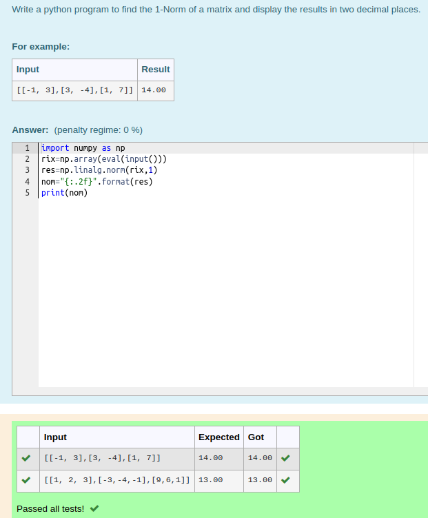
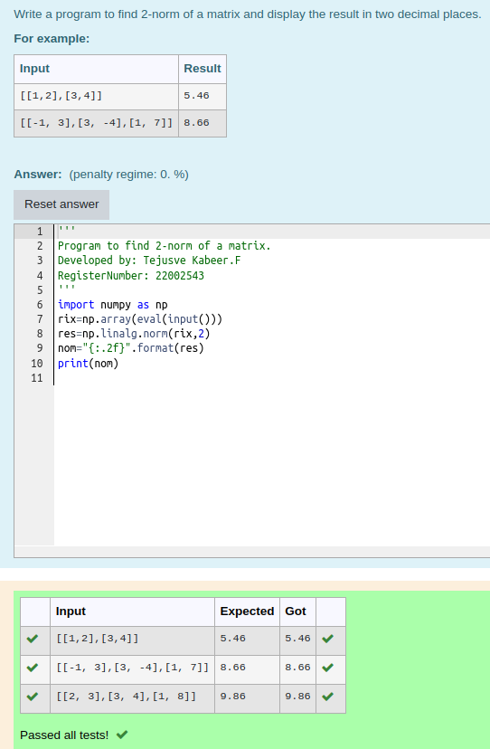
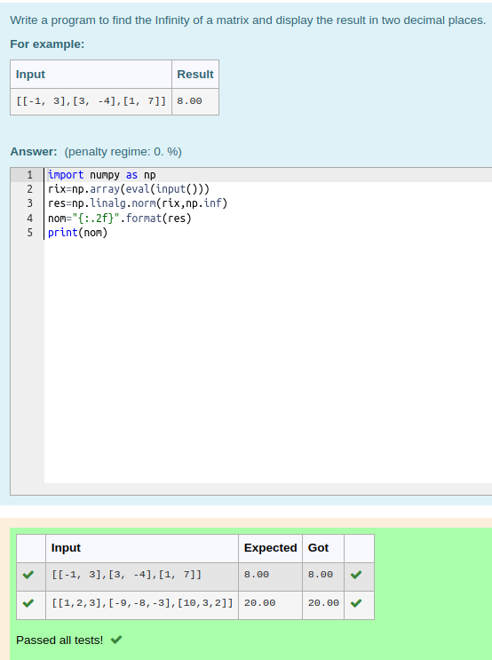

# Norm of a matrix

## Aim

To write a program to find the 1-norm, 2-norm and infinity norm of the matrix and display the result in two decimal places.

## Equipment’s required:

1.	Hardware – PCs
2.	Anaconda – Python 3.7 Installation / Moodle-Code Runner

## Algorithm:

	1. Get the input matrix using np.array()   
    2. Find the 2-norm of the matrix using np.linalg.norm()
	3. Print the norm of the matrix in two decimal places.

## Program:

```Python

# Register No: 22002543
# Developed By: Tejusve Kabeer.F

# 1-Norm of a Matrix
import numpy as np
rix=np.array(eval(input()))
res=np.linalg.norm(rix,1)
nom="{:.2f}".format(res)
print(nom)

# 2-Norm of a Matrix
import numpy as np
rix=np.array(eval(input()))
res=np.linalg.norm(rix,2)
nom="{:.2f}".format(res)
print(nom)

# Infinity Norm of a Matrix
import numpy as np
rix=np.array(eval(input()))
res=np.linalg.norm(rix,np.inf)
nom="{:.2f}".format(res)
print(nom)

```
## Output:
### 1-Norm of a Matrix
<br>
<br>
<br>

### 2-Norm of a Matrix
<br>
<br>
<br>

### Infinity Norm of a Matrix
<br>
<br>
<br>

## Result
Thus the program for 1-norm, 2-norm and Infinity norm of a matrix are written and verified.
